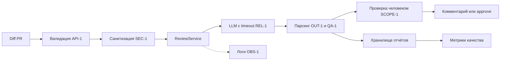

# ADR: решение для первого рабочего сценария

- Статус: accepted
- Дата: 2026-09-20
- Ответственные: Backend-разработчик, ML-инженер

## Контекст

Нужен сервис, который получает diff PR и возвращает структурированный отчёт: краткое описание, не более трёх рисков (файл, строка, доказательство) и список проверок. Решение approve/merge всегда принимает человек. Вход первого сценария — `TRAINING_PR.diff`, изменяющий `app/review_service.py` и `app/api.py`.

Действуют правила репозитория: `SEC-1` (удалять секреты до отправки во внешний LLM), `API-1` (diff > 20 000 символов → HTTP 413), `REL-1` (timeout 10 с, ошибка → контролируемый ответ), `OUT-1` (ответ `summary` + `risks` ≤ 3 + `checks`), `SCOPE-1` (сервис только советует), `QA-1` (риск только с evidence), `OBS-1` (в логах только `request_id`, длительность, статус).

## Решение

Использовать FastAPI-сервис с отдельным модулем `ReviewService`, который:

1. валидирует размер diff (`API-1`) и возвращает 413 до вызова LLM;
2. санитизирует diff — вырезает токены, пароли и приватные ключи (`SEC-1`);
3. вызывает LLM через провайдера с timeout 10 с (`REL-1`);
4. парсит ответ в структуру `summary` + `risks` (≤ 3) + `checks` (`OUT-1`);
5. фильтрует риски без `file:line` и evidence (`QA-1`);
6. пишет в лог только `request_id`, длительность, статус (`OBS-1`);
7. не выполняет approve, merge или действия в GitHub (`SCOPE-1`).

Промпт содержит diff, правила и жёсткий формат ответа. Результат сохраняется в файловое хранилище на первом этапе с возможностью замены на БД.

## Рассмотренные альтернативы

| Альтернатива | Почему не выбрали сейчас |
|---|---|
| Полностью rule-based анализатор | Быстро и дёшево, но плохо ловит контекстные проблемы; не покрывает цель «помощник ревьюера» |
| LLM без структурированного формата | Гибко, но невоспроизводимо: сложно проверять вывод и измерять качество (`OUT-1`) |
| LLM без санитизации diff | Нарушает `SEC-1`: токены и приватные ключи уходят внешнему провайдеру |
| LLM + структурированный формат + санитизация (принято) | Воспроизводимо, проверяемо, соответствует всем правилам репозитория |
| Собственная модель | Дорого и долго на этапе пилота, нет данных для обучения |

## Последствия и главный риск

- Положительные последствия: воспроизводимый отчёт (`OUT-1`), защита секретов (`SEC-1`), контролируемые отказы (`REL-1`), человек сохраняет контроль (`SCOPE-1`).
- Ограничения: зависимость от LLM-провайдера, нужен контроль rate limit и стоимости; жёсткое ограничение 20 000 символов (`API-1`) отклоняет крупные PR.
- Главный риск: помощник выдаёт правдоподобный, но неверный риск, и ревьюер ему доверяет.
- Как проверим риск: сравнение отчётов P1-01 и P1-02, доля подтверждённых рисков ≥ 40%, выборочная ручная проверка ревьюером с опорой на `QA-1`.

## Архитектурная схема

## Как использовали AI

- Для чего: предложить архитектурное решение, альтернативы и схему, оценить главный риск.
- Тип промпта: zero-shot с уточнениями в диалоге.
- Строка в `prompts.md`: P1-00.
- Что проверил студент: схема сверена с правилами `SEC-1`, `API-1`, `REL-1`, `OUT-1`, `SCOPE-1`, `QA-1`, `OBS-1` из `CASE.md`; альтернатива «LLM без санитизации» добавлена как явное нарушение `SEC-1`.