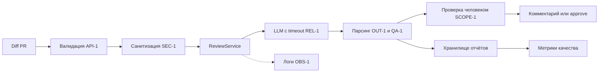

# ADR: решение для первого рабочего сценария

- Статус: accepted
- Дата: 2026-09-20
- Ответственные: Backend-разработчик, ML-инженер

## Контекст

Нужен сервис, который получает diff PR и возвращает структурированный отчёт: краткое описание, не более трёх рисков (файл, строка, доказательство) и список проверок. Решение approve/merge всегда принимает человек. Вход первого сценария — `TRAINING_PR.diff`, изменяющий `app/review_service.py` и `app/api.py`.

Действуют правила репозитория: `SEC-1` (удалять секреты до отправки во внешний LLM), `API-1` (diff > 20 000 символов → HTTP 413), `REL-1` (timeout 10 с, ошибка → контролируемый ответ), `OUT-1` (ответ `summary` + `risks` ≤ 3 + `checks`), `SCOPE-1` (сервис только советует), `QA-1` (риск только с evidence), `OBS-1` (в логах только `request_id`, длительность, статус).

## Решение

Использовать FastAPI-сервис с отдельным модулем `ReviewService`, который:

1. валидирует размер diff (`API-1`) и возвращает 413 до вызова LLM;
2. санитизирует diff — вырезает токены, пароли и приватные ключи (`SEC-1`). Основной слой — регулярные выражения (`sk-`, `password=`, `PRIVATE KEY`); `detect-secrets` подключён как тест-оракул. Allow-list (отправка кода без строковых литералов) отклонён: гарантирует `SEC-1`, но снижает качество ревью (см. «Рассмотренные альтернативы», Выбор 2);
3. вызывает LLM через провайдера с timeout 10 с (`REL-1`);
4. парсит ответ в структуру `summary` + `risks` (≤ 3) + `checks` (`OUT-1`);
5. фильтрует риски без `file:line` и evidence (`QA-1`);
6. пишет в лог только `request_id`, длительность, статус (`OBS-1`);
7. не выполняет approve, merge или действия в GitHub (`SCOPE-1`).

Промпт содержит diff, правила и жёсткий формат ответа. Результат сохраняется в файловое хранилище на первом этапе с возможностью замены на БД.

## Рассмотренные альтернативы

Решение требует двух независимых выборов: как реализовать LLM-часть и как реализовать `SEC-1` (удаление секретов перед отправкой). По ToT рассматриваем каждое отдельно.

### Выбор 1: реализация анализа

| Альтернатива | Плюсы | Минусы | Оценка по критериям (соответствие / воспроизводимость / стоимость / риск) |
|---|---|---|---|
| Полностью rule-based анализатор | Быстро, дёшево, детерминированно | Не ловит контекстные проблемы | Соответствие: нет / Воспроизводимость: высокая / Стоимость: низкая / Риск: высокий (пропустит контекст) |
| LLM без структурированного формата | Гибко, просто | Невоспроизводимо, нельзя измерить качество | Соответствие: нет (`OUT-1`) / Воспроизводимость: низкая / Стоимость: средняя / Риск: высокий |
| **LLM + структурированный формат + санитизация (принято)** | Воспроизводимо, проверяемо, соответствует всем правилам | Зависит от провайдера, нужны метрики | Соответствие: да / Воспроизводимость: высокая / Стоимость: средняя / Риск: средний |
| Собственная модель | Полный контроль | Дорого, долго, нет данных для обучения | Соответствие: да / Воспроизводимость: высокая / Стоимость: очень высокая / Риск: высокий |

### Выбор 2: реализация `SEC-1`

| Альтернатива | Плюсы | Минусы | Оценка по критериям |
|---|---|---|---|
| **A. Регулярные выражения** (`sk-`, `password=`, `PRIVATE KEY`) — принято как основной слой | Просто, быстро, мало зависимостей | Пропускает нестандартные форматы | Соответствие: да / Воспроизводимость: высокая / Стоимость: низкая / Ложные срабатывания: средние |
| **B. Библиотека-детектор** (`detect-secrets`) — принято как тест-оракул | Ловит много форматов, обновляется сообществом | Тяжёлая зависимость, нужна настройка | Соответствие: да / Воспроизводимость: средняя / Стоимость: высокая / Ложные срабатывания: низкие |
| **C. Allow-list** (отправляем код без строковых литералов) | Гарантирует, что секреты физически не уйдут | Модель теряет часть контекста, качество ревью падает | Соответствие: да / Воспроизводимость: высокая / Стоимость: низкая / Ложные срабатывания: минимальные / Качество ревью: падает |

**Итог ToT:**

- Для анализа выбираем LLM + структурированный формат + санитизацию — единственный вариант, который одновременно проходит `OUT-1`, `QA-1` и `SEC-1`.
- Для `SEC-1` выбираем комбинацию **A + B**: регулярные выражения как основной слой, `detect-secrets` как тест-оракул. Вариант C отклонён: он гарантирует `SEC-1`, но снижает качество ревью (модель не видит строковые литералы).

## Последствия и главный риск

- Положительные последствия: воспроизводимый отчёт (`OUT-1`), защита секретов (`SEC-1`), контролируемые отказы (`REL-1`), человек сохраняет контроль (`SCOPE-1`).
- Ограничения: зависимость от LLM-провайдера, нужен контроль rate limit и стоимости; жёсткое ограничение 20 000 символов (`API-1`) отклоняет крупные PR.
- Главный риск: помощник выдаёт правдоподобный, но неверный риск, и ревьюер ему доверяет.
- Как проверим риск: выборочная ручная сверка 10 отчётов в спринт; доля подтверждённых рисков ≥ 40%; при падении ниже — пересмотр промпта и Context Pack. Дополнительно — сравнение отчётов P1-01 и P1-02 в `prompts.md`.

## Архитектурная схема

## Как использовали AI

- Для чего: предложить архитектурное решение, альтернативы и схему, оценить главный риск.
- Тип промпта: zero-shot с уточнениями в диалоге.
- Строка в `prompts.md`: P1-00.
- Что проверил студент: схема сверена с правилами `SEC-1`, `API-1`, `REL-1`, `OUT-1`, `SCOPE-1`, `QA-1`, `OBS-1` из `CASE.md`; альтернатива «LLM без санитизации» добавлена как явное нарушение `SEC-1`.