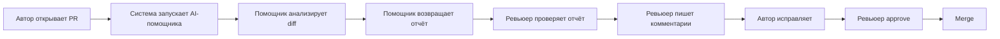

# Анализ процесса: AS IS и TO BE

## AS IS

Участники: автор PR, ревьюер, GitHub, команда разработки.

Текущий процесс: автор открывает PR → ревьюер получает уведомление → вручную читает diff → ищет проблемы → пишет комментарии → автор исправляет → ревьюер approve → merge.

Задержки и ручные операции:
- ручное чтение diff и поиск проблем — самая долгая часть;
- обратная связь приходит поздно, автор ждёт;
- механические проверки (секреты, небезопасные вызовы, отсутствие валидации) повторяются из PR в PR;
- нагрузка распределена неравномерно — уставший ревьюер пропускает дефекты.

Точки потери информации: комментарии ревьюера не сохраняются как данные о подтверждённых рисках, поэтому качество помощника потом сложно измерить.

## TO BE

Один процесс после изменения: автор открывает PR → система запускает AI-помощника → помощник анализирует diff и возвращает отчёт (описание, до трёх рисков, проверки) → ревьюер проверяет отчёт → пишет комментарии → автор исправляет → approve → merge.

## Разница

| Что меняется | AS IS | TO BE | Как проверим изменение |
|---|---|---|---|
| Начало работы ревьюера | Читает diff с нуля | Начинает с готового отчёта | Замер времени до первого комментария |
| Поиск проблем | Вручную | Автоматически + проверка человеком | Доля рисков, найденных помощником и подтверждённых ревьюером |
| Обратная связь | Приходит после чтения diff | Приходит раньше | Время до первого комментария ≤ 1 ч |
| Нагрузка | Неравномерная | Разгружается рутина | Опрос удовлетворённости ≥ 4.0 |

## Как использовали AI

- Для чего: описать AS IS и TO BE процесса, выделить узкие места и точки потери информации.
- Тип промпта: zero-shot.
- Строка в `prompts.md`: P1-00.
- Что проверил студент: AS IS согласован с интервью; TO BE проверена на ограничение «помощник не approve/merge».