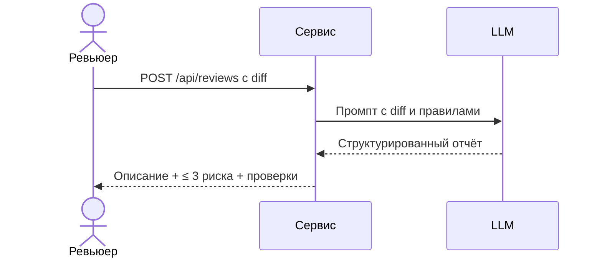

# Use cases и user stories

## Первый рабочий сценарий

**Когда** автор открывает PR с diff, **система** отправляет diff помощнику и получает структурированный отчёт, **а пользователь получает** краткое описание изменения, до трёх подтверждённых рисков и список проверок.

Не входит в этот сценарий:

- автоматический approve и merge;
- изменение кода автора;
- замена ревьюера;
- работа с PR без diff (пустой diff).

## Use case

| Поле | Значение |
|---|---|
| Актор | Ревьюер PR |
| Триггер | Поступил новый PR с непустым diff |
| Предусловия | PR открыт, diff доступен, LLM-провайдер доступен |
| Основной результат | Отчёт: описание, ≤ 3 риска (файл, строка, доказательство), список проверок |
| Ошибка или отказ | Пустой diff → 400; нет поля `diff` → 422; ошибка LLM → 502, ревьюер продолжает вручную |



## User stories и acceptance criteria

```gherkin
Feature: AI-помощник ревьюера PR

  Scenario: Позитивный — отчёт получен
    Given открыт PR с непустым diff
    When система вызывает POST /api/reviews
    Then ответ содержит краткое описание, не более трёх рисков и список проверок
    And каждый риск содержит файл, строку и доказательство

  Scenario: Негативный — пустой diff
    Given открыт PR с пустым diff
    When система вызывает POST /api/reviews с diff=""
    Then сервис возвращает HTTP 400
    And риски не формируются

  Scenario: Граничный — нет поля diff
    Given тело запроса не содержит поля diff
    When система вызывает POST /api/reviews
    Then сервис возвращает HTTP 422
    And ревьюер видит понятное сообщение об ошибке
```

## Как использовали AI

- Для чего: сформировать первый рабочий сценарий, use case, user stories и acceptance criteria.
- Тип промпта: few-shot (пример хорошего и плохого комментария из Context Pack).
- Строка в `prompts.md`: P1-00.
- Что проверил студент: сценарии сверены с ограничениями (не approve/merge/менять код); негативный и граничный сценарии добавлены по рискам из diff.