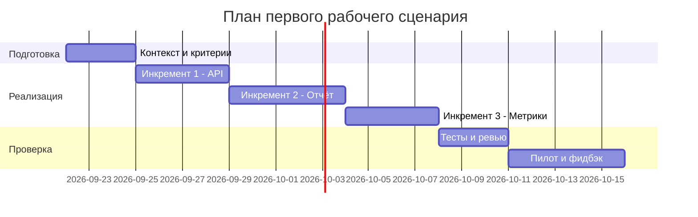

# План поставки

## Инкременты и ответственность

| Инкремент | Наблюдаемый результат | Что делает человек | Что делает AI или субагент | Проверка | Зависимости |
|---|---|---|---|---|---|
| 1. API и парсинг diff | POST /api/reviews принимает diff и возвращает сырой ответ LLM | Проектирует контракт API, ревьюит код | Пишет FastAPI-эндпоинт, тесты, разбирает diff | Integration-тест: POST с валидным diff | TRAINING_PR.diff, FastAPI |
| 2. Структурированный отчёт | Ответ содержит описание, ≤ 3 риска (файл, строка, доказательство), проверки | Согласует формат, проверяет примеры | Формирует промпт, парсит ответ LLM, пишет unit-тесты | E2E: прогон на TRAINING_PR.diff | Инкремент 1, доступ к LLM |
| 3. Хранение и метрики | Каждый отчёт сохраняется, метрики подтверждённых рисков собираются | Определяет метрики, оценивает качество | Пишет сохранение в файл/БД, собирает статистику | Integration-тест: файл создан, метрики рассчитаны | Инкремент 2 |
| 4. UI и пилот | Ревьюер видит отчёт в интерфейсе PR | Пилотирует на команде, собирает фидбэк | Собирает UI, автоматизирует сбор фидбэка | Опрос удовлетворённости ≥ 4.0 | Инкремент 3 |

## Диаграмма Ганта

## Как использовали AI

- Для чего: разложить работу на инкременты, распределить роли человека и AI, собрать план поставки.
- Тип промпта: zero-shot.
- Строка в `prompts.md`: P1-00.
- Что проверил студент: ограничение «AI не approve/merge/менять код» зафиксировано в ролях; инкременты согласованы с метриками из `problem.md`.